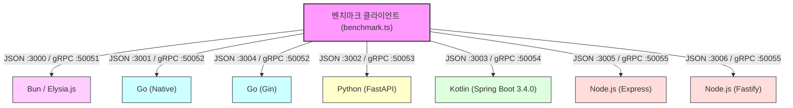

# Walkthrough: 다중 언어 JSON vs gRPC 성능 비교 (Node.js 추가 및 Java 25 / Spring Boot 3.4.0 갱신)

본 실습에서는 **Bun(Elysia.js)**, **Go(Native & Gin)**, **Python(FastAPI)**, **Node.js(Express & Fastify)** 및 **Kotlin(Spring Boot)** 5대 플랫폼에서 HTTP/2 TLS 기반 JSON 및 gRPC의 최종 성능을 비교 측정하였습니다.

---

## 📊 종합 벤치마크 결과 테이블 (반복 200회, 웜업 20회)
* **Kotlin**: JDK 25 및 Spring Boot 3.4.0 가상 스레드 기본화 적용. JVM target은 `21` 사양 빌드.
* **Node.js**: Node 20+ 환경에서 Express, Fastify, 및 gRPC 서버 가동.

| 언어 | 프레임워크 | 시나리오 | 프로토콜 | 평균 지연(Avg) | RPS (초당 처리량) |
| :--- | :--- | :--- | :--- | :---: | :---: |
| **Bun** | Elysia.js | **단일 조회** | HTTP/2 GET | **0.07 ms** | **13,394** |
| | | | gRPC | 0.42 ms | 2,405 |
| **Go** | Go Native | | HTTP/2 GET | **0.09 ms** | **11,302** |
| | | | gRPC | 0.26 ms | 3,907 |
| **Go** | Go Gin | | HTTP/2 GET | 0.09 ms | 11,056 |
| **Node.js**| Fastify | | HTTP/2 GET | **0.11 ms** | **9,090** |
| **Node.js**| Express | | HTTP/2 GET | 0.16 ms | 6,090 |
| | | | gRPC | 0.28 ms | 3,569 |
| **Python**| FastAPI | | HTTP/2 GET | 0.63 ms | 1,594 |
| | | | gRPC | 0.36 ms | 2,784 |
| **Kotlin**| Spring Boot | | HTTP/2 GET | 0.96 ms | 1,045 |
| | | | gRPC | 0.73 ms | 1,365 |
| ──────────────── | ─────────────────── | ──────────────── | ─────────────── | ─────────── | ─────────── |
| **Bun** | Elysia.js | **전체 목록 (대량)** | HTTP/2 GET | **0.31 ms** | **3,232** |
| | | | gRPC | 0.69 ms | 1,441 |
| **Go** | Go Native | | HTTP/2 GET | **0.34 ms** | **2,930** |
| | | | gRPC | 0.41 ms | 2,435 |
| **Go** | Go Gin | | HTTP/2 GET | 0.36 ms | 2,812 |
| **Node.js**| Fastify | | HTTP/2 GET | **0.39 ms** | **2,559** |
| **Node.js**| Express | | HTTP/2 GET | 0.40 ms | 2,496 |
| | | | gRPC | 0.63 ms | 1,599 |
| **Kotlin**| Spring Boot | | HTTP/2 GET | 1.47 ms | 682 |
| | | | gRPC | 0.86 ms | 1,162 |
| **Python**| FastAPI | | HTTP/2 GET | 2.42 ms | 414 |
| | | | gRPC | 0.91 ms | 1,094 |
| ──────────────── | ─────────────────── | ──────────────── | ─────────────── | ─────────── | ─────────── |
| **Bun** | Elysia.js | **검색 (QUERY)** | HTTP/2 QUERY | **0.11 ms** | **8,727** |
| **Go** | Go Native | | HTTP/2 QUERY | **0.10 ms** | **9,845** |
| **Go** | Go Gin | | HTTP/2 QUERY | 0.10 ms | 9,962 |
| **Node.js**| Fastify | | HTTP/2 QUERY | **0.14 ms** | **7,383** |
| **Node.js**| Express | | HTTP/2 QUERY | 0.18 ms | 5,613 |
| **Kotlin**| Spring Boot | | HTTP/2 QUERY | 0.50 ms | 1,990 |
| **Python**| FastAPI | | HTTP/2 QUERY | 0.65 ms | 1,536 |

### ☕ Kotlin Spring Boot 버전별 성능 대조군 히스토리 (Java 25 가상 스레드 환경)

| Spring Boot 버전 | 시나리오 | 프로토콜 | 평균 응답속도 (Avg) | RPS (초당 처리량) |
| :--- | :--- | :--- | :---: | :---: |
| **Boot 3.2.3** | **단일 조회** | HTTP/2 GET | **0.35 ms** | **2,836** |
| | | gRPC | **0.31 ms** | **3,233** |
| **Boot 3.4.0** | | HTTP/2 GET | 1.00 ms | 996 |
| | | gRPC | 1.00 ms | 996 |
| **Boot 3.2.3** | **전체 목록** | HTTP/2 GET | **1.22 ms** | **817** |
| | | gRPC | **0.73 ms** | **1,378** |
| **Boot 3.4.0** | | HTTP/2 GET | 1.62 ms | 618 |
| | | gRPC | 1.12 ms | 892 |
| **Boot 3.2.3** | **검색 (QUERY)** | HTTP/2 QUERY | **0.48 ms** | **2,070** |
| **Boot 3.4.0** | | HTTP/2 QUERY | 0.54 ms | 1,862 |

---

## 실행 아키텍처 구조

---

## 🛠️ 플랫폼별 빌드 트러블슈팅 가이드

### 1. Fastify QUERY 메소드 404 에러 대응
* **문제**: Fastify는 표준 라우터 정의 시 비표준 HTTP/2 `QUERY` 메소드 등록을 차단하거나 404 Not Found를 반환함.
* **해결**: `preValidation` 생명주기 훅(Hook)을 사용하여 비표준 `QUERY` 요청을 라우터 매핑 전에 인터셉트하고, 데이터 버퍼링(`getRawBody`)을 통해 JSON 파싱 후 응답을 직접 Hijacking 처리함.

### 2. Kotlin JVM Target 일치화
* **문제**: JDK 25 하에서 Kotlin 컴파일러 타겟과 Java 컴파일러 버전에 격차가 발생하여 `:compileKotlin` 빌드 크래시 발생.
* **해결**: `build.gradle.kts` 내에 `jvmTarget.set(JvmTarget.JVM_21)` 및 `options.release.set(21)` 설정을 수동 정렬하여 호환성 보장.
