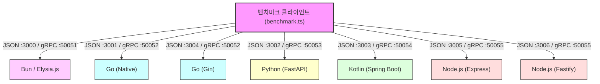

# Walkthrough: 다중 언어 JSON vs gRPC 성능 비교 (Node.js 추가 및 Java 25 갱신)

본 실습에서는 **Bun(Elysia.js)**, **Go(Native & Gin)**, **Python(FastAPI)**, **Node.js(Express & Fastify)** 및 **Kotlin(Spring Boot)** 5대 플랫폼에서 HTTP/2 TLS 기반 JSON 및 gRPC의 최종 성능을 비교 측정하였습니다.

---

## 📊 종합 벤치마크 결과 테이블 (반복 200회, 웜업 20회)
* **Kotlin**: JDK 25 및 `spring.threads.virtual.enabled: true` 적용. JVM target은 `21` 사양 빌드.
* **Node.js**: Node 20+ 환경에서 Express, Fastify, 및 gRPC 서버 가동.

| 언어 | 프레임워크 | 시나리오 | 프로토콜 | 평균 응답속도 (Avg) | 중앙값 (Med) | P95 | RPS (처리량) |
| :--- | :--- | :--- | :--- | :---: | :---: | :---: | :---: |
| **Bun** | Elysia.js | **단일 조회** | HTTP/2 GET | **0.08 ms** | 0.06 ms | 0.19 ms | **12,070** |
| | | | gRPC | 0.37 ms | 0.31 ms | 0.70 ms | 2,694 |
| **Go** | Go Native | | HTTP/2 GET | **0.07 ms** | 0.07 ms | 0.10 ms | **13,717** |
| | | | gRPC | 0.26 ms | 0.24 ms | 0.37 ms | 3,826 |
| **Go** | Go Gin | | HTTP/2 GET | 0.09 ms | 0.08 ms | 0.12 ms | 11,403 |
| **Node.js**| Fastify | | HTTP/2 GET | **0.14 ms** | 0.13 ms | 0.22 ms | **7,364** |
| **Node.js**| Express | | HTTP/2 GET | 0.16 ms | 0.15 ms | 0.26 ms | 6,207 |
| | | | gRPC | 0.29 ms | 0.26 ms | 0.41 ms | 3,425 |
| **Python**| FastAPI | | HTTP/2 GET | 0.56 ms | 0.53 ms | 0.84 ms | 1,786 |
| | | | gRPC | 0.35 ms | 0.33 ms | 0.56 ms | 2,860 |
| **Kotlin**| Spring Boot | | HTTP/2 GET | 0.36 ms | 0.30 ms | 0.47 ms | 2,768 |
| | | | gRPC | 0.28 ms | 0.25 ms | 0.40 ms | 3,610 |
| ──────────────── | ─────────────────── | ──────────────── | ─────────────── | ─────────── | ─────────── | ─────────── | ─────────── |
| **Bun** | Elysia.js | **전체 목록 (대량)** | HTTP/2 GET | **0.30 ms** | 0.29 ms | 0.45 ms | **3,286** |
| | | | gRPC | 0.63 ms | 0.56 ms | 1.17 ms | 1,589 |
| **Go** | Go Native | | HTTP/2 GET | **0.30 ms** | 0.27 ms | 0.36 ms | **3,350** |
| | | | gRPC | 0.42 ms | 0.39 ms | 0.54 ms | 2,398 |
| **Go** | Go Gin | | HTTP/2 GET | 0.31 ms | 0.30 ms | 0.47 ms | 3,202 |
| **Node.js**| Fastify | | HTTP/2 GET | **0.36 ms** | 0.34 ms | 0.42 ms | **2,785** |
| **Node.js**| Express | | HTTP/2 GET | 0.39 ms | 0.37 ms | 0.51 ms | 2,549 |
| | | | gRPC | 0.58 ms | 0.51 ms | 0.89 ms | 1,713 |
| **Kotlin**| Spring Boot | | HTTP/2 GET | 1.19 ms | 1.09 ms | 1.59 ms | 838 |
| | | | gRPC | 0.63 ms | 0.57 ms | 0.98 ms | 1,588 |
| **Python**| FastAPI | | HTTP/2 GET | 2.49 ms | 2.30 ms | 3.53 ms | 402 |
| | | | gRPC | 0.90 ms | 0.80 ms | 1.59 ms | 1,114 |
| ──────────────── | ─────────────────── | ──────────────── | ─────────────── | ─────────── | ─────────── | ─────────── | ─────────── |
| **Bun** | Elysia.js | **검색 (QUERY)** | HTTP/2 QUERY | **0.10 ms** | 0.10 ms | 0.14 ms | **9,625** |
| **Go** | Go Native | | HTTP/2 QUERY | **0.10 ms** | 0.10 ms | 0.15 ms | **9,685** |
| **Go** | Go Gin | | HTTP/2 QUERY | 0.09 ms | 0.08 ms | 0.13 ms | 11,211 |
| **Node.js**| Fastify | | HTTP/2 QUERY | **0.16 ms** | 0.14 ms | 0.23 ms | **6,418** |
| **Node.js**| Express | | HTTP/2 QUERY | 0.18 ms | 0.18 ms | 0.28 ms | 5,439 |
| **Kotlin**| Spring Boot | | HTTP/2 QUERY | 0.47 ms | 0.35 ms | 0.57 ms | 2,116 |
| **Python**| FastAPI | | HTTP/2 QUERY | 0.59 ms | 0.54 ms | 0.94 ms | 1,691 |

---

## 실행 아키텍처 구조

---

## 🛠️ 플랫폼별 빌드 트러블슈팅 가이드

### 1. Fastify QUERY 메소드 404 에러 대응
* **문제**: Fastify는 표준 라우터 정의 시 비표준 HTTP/2 `QUERY` 메소드 등록을 차단하거나 404 Not Found를 반환함.
* **해결**: `preValidation` 생명주기 훅(Hook)을 사용하여 비표준 `QUERY` 요청을 라우터 매핑 전에 인터셉트하고, 데이터 버퍼링(`getRawBody`)을 통해 JSON 파싱 후 응답을 직접 Hijacking 처리함.

### 2. Kotlin JVM Target 일치화
* **문제**: JDK 25 하에서 Kotlin 컴파일러 타겟과 Java 컴파일러 버전에 격차가 발생하여 `:compileKotlin` 빌드 크래시 발생.
* **해결**: `build.gradle.kts` 내에 `jvmTarget.set(JvmTarget.JVM_21)` 및 `options.release.set(21)` 설정을 수동 정렬하여 호환성 보장.
